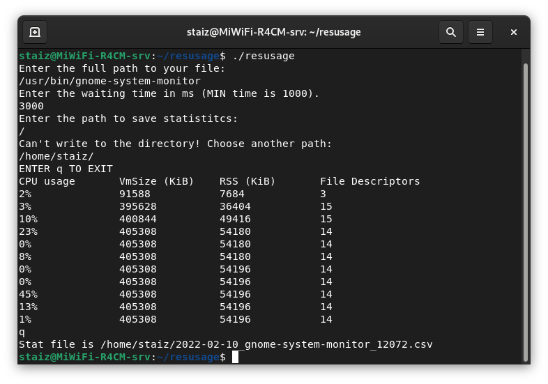
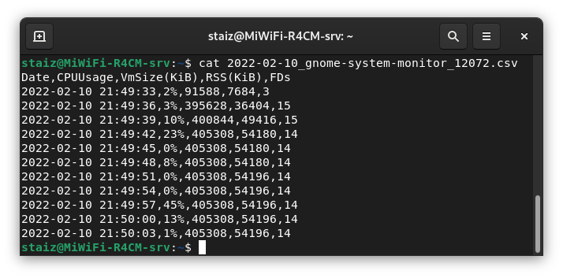

# resusage

> $ g++ -std=c++17 resusage.cpp -o resusage -pthread

> $ ./resusage

The progam displays the resourse usage of a specific process at regular intervals set by user. The data is obtained from Linux `/proc` files.

Output is a CSV file containing the following data: 

- Timestamp
- CPU Usage (%)
- Virtual Memory Size (KiB)
- Resident Set Size (KiB)
- Number of File Descriptors of the Process

### User input:

### CSV output:

The output data format allows for automated graph plotting based on a CSV file.
